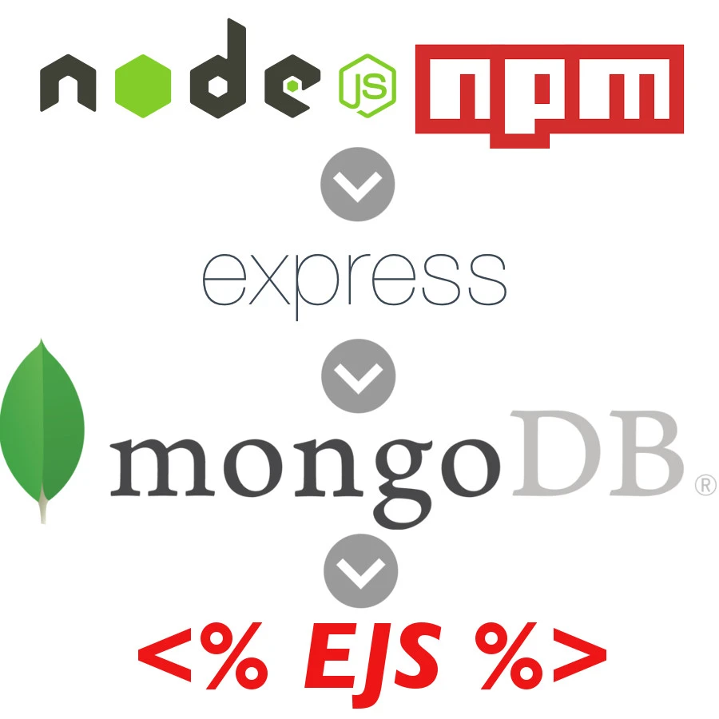

# PROJECT 2

- **Project Name:** Card List
- **Project By:**   Nyijia Morgan
- [**LINK TO GITHUB**](https://github.com/nmorgan24/project2)
- [**LINK TO DEPLOYED WEBSITE**](https://project2-q0f5.onrender.com)
- **List of Technologies used:** HTML, JS, CSS, Node, Express, EJS, Mongo
- [**LINK TO TRELLO**](http://www.render.com)

## Description

Card List is a user-friendly website that empowers users to create an account, login, and seamlessly store and save their list of cards. Whether you're an avid collector of trading cards, sports cards, or any other type of cards, Card List provides the perfect digital space to organize and manage your collection. With a secure account, users gain access to a personalized dashboard where they can effortlessly categorize and curate their cards based on their own preferences. Uploading card images or manually inputting card details ensures that your collection is accurately documented. With Card List, finding specific cards within your collection is a breeze thanks to its intuitive search and filtering functionality. Plus, rest assured knowing that your card list is safely stored and protected. Join CardStash today and take control of your card collection like never before!

## Mock UP of UI

- 

## List of Backend Endpoints

| ENDPOINT | METHOD | PURPOSE |
|----------|--------|---------|
|/users/login | POST | Login Page |
|/users/register | POST | Register Page |
|/cards/mycards | GET | List of cards |
|/cards/card/id: | GET | card Details |
|/cards/newCard | POST | Add new card to list |

## List of Technologies used

- 

## ERD (ENTITY RELATIONSHIP DIAGRAM)

- [Free ERD Diagram Tool](https://dbdiagram.io/home)# project2
